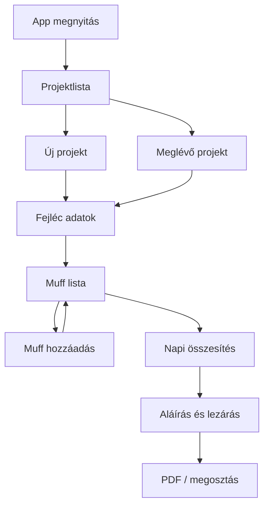

# Muffe Plan — termékterv

## Háttér

A papíros űrlap: **Abnahmeprotokoll für Fernwärmeleitungen** (BRUGG Pipes).
A terepen kézzel töltik: projektadatok, ellenállásmérés, skicc, **Druckprobenprotokoll** (muffok átmérő szerint), aláírás.

A legfájdalmasabb rész: **sok (30–40) különböző muff** rögzítése és nap végi összesítése.

## Fő felhasználó

- Szerelő / monteur a bajsztelepen
- Nap közben gyorsan rögzít, nap végén ellenőriz / lezár / átad

## Fő értékajánlat

> Nap végére egy pillantással látom, mennyi muff ment el, átmérő szerint, projektenként — papír nélkül.

## Felhasználói folyamat (MVP)

### 1. Projekt (helyszín)

Papír mezők → app mezők:

| Papír | App |
|---|---|
| Betreiber | Üzemeltető |
| Verlegefirma | Fektető cég |
| Baustellenort | Bajsztelep / cím |
| Anlage mit Ohmmeter / MH3 | Méréstípus (opció) |
| Datum | Dátum (automatikus + szerkeszthető) |

### 2. Muff rögzítés (elsődleges funkció)

A papír **Druckprobenprotokoll** táblája:

| Mező | Példa | Megjegyzés |
|---|---|---|
| Mantelrohr DM | 90, 110, 125, 315… | Előre definiált + egyedi DM |
| Schrumpfmuffen Stk. | 21 | Darabszám |
| Bögen / Formstücke | — | Másodlagos, MVP-ben opcionális |
| Prüfdruck | 0,3 Bar | Nyomáspróba |

**UX elvárás (30–40 tétel):**

- Gyors hozzáadás: DM kiválasztás → darabszám → mentés (kevés kattintás)
- Gyakori DM-ek kedvencként / előre töltve
- Lista görgethető, kereshető DM szerint
- Futó **összesen** számláló a képernyő tetején / alján
- Nap végi összesítő nézet: DM → Stk. összeg

### 3. Összesítés nap végére

- Projektenként: muff darabszám DM-enként
- Globális napi összesítés (összes mai projekt)
- Egy gomb: „Napi összefoglaló”

### 4. Későbbi / nem MVP

- Ellenállásmérés tábla (Vorlauf / Rücklauf, Neu / Bestand)
- Skicc / Verdrahtungsschema (rajzolás, X a muffokra)
- Digitális aláírás + BRUGG monteur mező
- PDF export a papír formához hasonló elrendezéssel
- Szinkron / több eszköz

## Nyelvek

- Első UI nyelv: **német** (a jegyzőkönyv nyelve) + **magyar** (fejlesztői / belső használat)
- Mezőnevek a papírral egyezzenek (Schrumpfmuffen, Mantelrohr, Prüfdruck…)

## Sikerkritériumok

1. 30 muff felvitele < 5 perc (cél)
2. Nap végi összesítés 1 képernyőn, DM szerint csoportosítva
3. Offline működik a bajsztelepen
4. Projekt később megnyitható és módosítható
