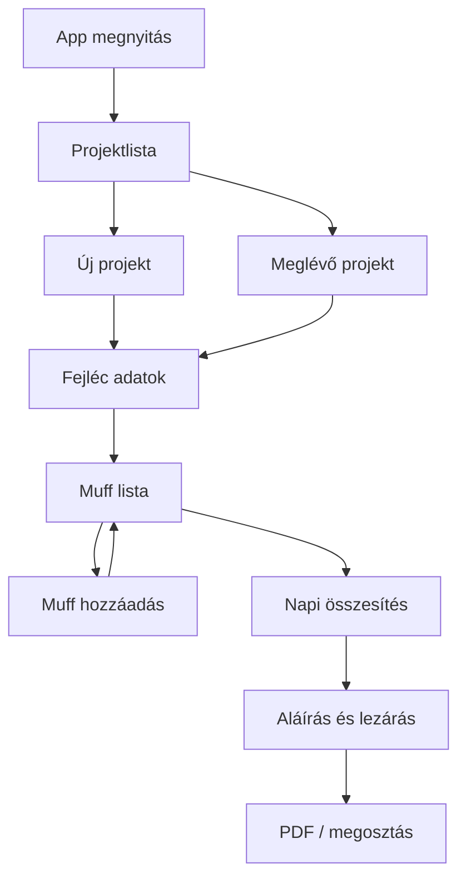

# Muffe Plan — termékterv

## Háttér

A papíros űrlap: **Abnahmeprotokoll für Fernwärmeleitungen** (BRUGG Pipes).
A terepen kézzel töltik: projektadatok, ellenállásmérés, skicc, **Druckprobenprotokoll** (muffok átmérő szerint), aláírás.

A legfájdalmasabb rész: **sok (30–40) különböző muff** rögzítése és nap végi összesítése.

## Fő felhasználó

- Szerelő / monteur a bajsztelepen
- Nap közben gyorsan rögzít, nap végén ellenőriz / lezár / átad

## Fő értékajánlat

> Nap végére egy pillantással látom, mennyi muff ment el, átmérő szerint, projektenként — papír nélkül.

## Felhasználói folyamat (MVP)

### 1. Projekt (helyszín)

Papír mezők → app mezők:

| Papír | App |
|---|---|
| Betreiber | Üzemeltető |
| Verlegefirma | Fektető cég |
| Baustellenort | Bajsztelep / cím |
| Anlage mit Ohmmeter / MH3 | Méréstípus (opció) |
| Datum | Dátum (automatikus + szerkeszthető) |

### 2. Rajzlap + muff rögzítés (elsődleges funkció)

A projekt főképernyője egy **teljes telefonkijelzős rajzlap**:

1. **Rajz mód** (alapértelmezett): egy ujjmozdulat egyszerre készíti a két párhuzamos csővonalat — folytonos **VL / Vorlauf** (meleg előremenő) + szaggatott **RL / Rücklauf** (visszatérő).
2. **X mód** (külön aktiválandó): minden koppintás a legközelebbi csővonalra illeszt egy nyitott muffot jelző X-et.
3. Az összes aktuális, még át nem alakított X egy automatikus csoport; nincs külön kijelölés.
4. Hosszú nyomás vagy a `Muff (N)` gomb megnyitja a Muffe / Reduzir / Abzweig adatlapot.
5. Mentéskor minden aktuális X egy darab megadott tétellé alakul. A később lerakott X-ek új csoportot alkotnak.
6. Hegesztett muffnál külön típusok: **Bogenmuffe**, **Montagemuffe**, **Reduzirmuffe**, **Endmuffe**, **Montageabzweig**. Nincs Montagebogen.

A drótmérés nem része ennek a gyors adatlapnak.

A papír **Druckprobenprotokoll** táblája:

| Mező | Példa | Megjegyzés |
|---|---|---|
| Mantelrohr DM | 90, 110, 125, 315… | Előre definiált + egyedi DM |
| Schrumpfmuffen Stk. | 21 | Darabszám |
| Bögen / Formstücke | Bogenmuffe, Montagemuffe, Reduzirmuffe, Endmuffe, Montageabzweig | Hegesztett muffnál |
| Prüfdruck | 0,3 Bar | Nyomáspróba |

**UX elvárás (30–40 tétel):**

- Gyors hozzáadás: DM kiválasztás → darabszám → mentés (kevés kattintás)
- Gyakori DM-ek kedvencként / előre töltve
- Lista görgethető, kereshető DM szerint
- Futó **összesen** számláló a képernyő tetején / alján
- Nap végi összesítő nézet: DM → Stk. összeg

### 3. Összesítés nap végére

- Projektenként: muff darabszám DM-enként
- Globális napi összesítés (összes mai projekt)
- Egy gomb: „Napi összefoglaló”

### 4. Drót mérés (későbbi kör — nem az első MVP)

A muff darabszám **nem** a drót mérés. A drót külön lépés:

1. Az összes nyitott muffon a drót össze van kötve **elejétől a végéig** (egy mérés a teljes szakaszra).
2. **Samponozás / schäumen előtt** rámérek → érték rögzítése (jó-e a drót).
3. **Utána** újra rámérek → összevetés (változott-e, szakadt-e, nedvesség stb.).
4. Hiba esetén: „itt meg ott bármi lehet” — a hiba a szakasz bármely muffjánál / szakaszánál lehet; a muff-lista segít tudni, *hány* kötés van a vonalon.

**Rendszerfajták (projekt / szakasz szintjén választandó):**

| Rendszer | Mit jelent a terepen |
|---|---|
| **NOR** (nordisches System, Cu) | Réz érzékelőhurok — egyszerűbb / más méréshatár |
| **Brand / BRANDES** (NiCr) | Brandes szenzorhurok — MH-szint, hurokhossz stb. |

A papír **Ohmmeter / MH3** mezője ehhez kapcsolódik: a projekten jelezni kell, **melyik rendszer** van (NOR vs Brand), mert a mért értékek és a „mi a jó” ettől függ.

**App-ban később (nem most):**

- Vorlauf / Rücklauf mérések
- Előtte / utána párok (samponozás előtt–után)
- Rendszer: `nor` \| `brandes`
- Opcionális megjegyzés (hol gyanús)

### 5. Egyéb későbbi / nem MVP

- Skicc / Verdrahtungsschema (rajzolás, X a muffokra)
- Digitális aláírás + BRUGG monteur mező
- PDF export a papír formához hasonló elrendezéssel
- Szinkron / több eszköz

## Nyelvek

- Első UI nyelv: **német** (a jegyzőkönyv nyelve) + **magyar** (fejlesztői / belső használat)
- Mezőnevek a papírral egyezzenek (Schrumpfmuffen, Mantelrohr, Prüfdruck…)

## Telepítés (PWA)

A webes Muffe Plan **Progressive Web App**: a jobb felső **Letöltés** gombbal a telefon kezdőképernyőjére tehető. A tartós cím a `main` ág: https://afecoh-cmyk.github.io/video-editor/ — offline is működik, nincs külön Play/App Store telepítő az MVP-ben.

## Sikerkritériumok

1. 30 muff felvitele < 5 perc (cél)
2. Nap végi összesítés 1 képernyőn, DM szerint csoportosítva
3. Offline működik a bajsztelepen
4. Projekt később megnyitható és módosítható
